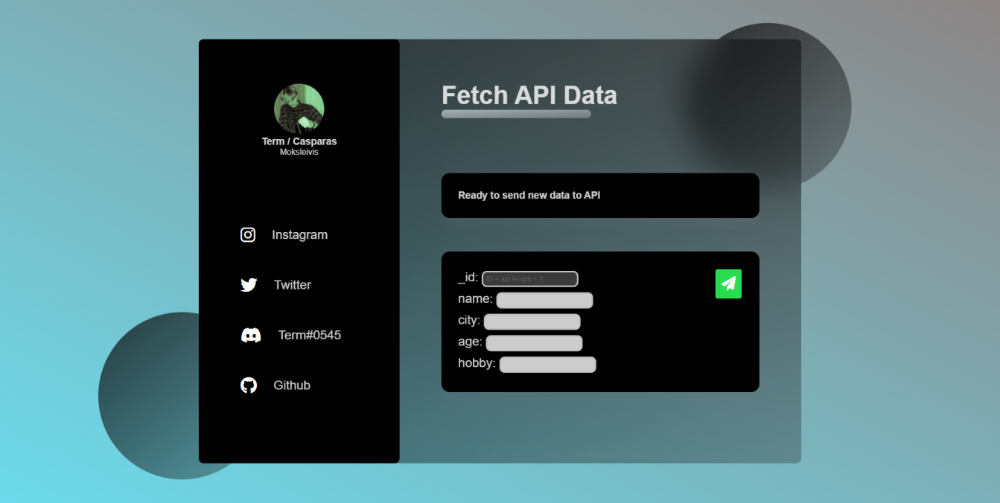

<h2>Užduotis:</h2>
• Pirmas puslapis: lentelė, kurioje atvaizduojami duomenys (List page) 
• Į antrą puslapį patenkama paspaudus ant lentelės eilutės. Šiame puspalyje rodomos įrašo detalės
(details page) 
• Trečias puslapis (patenkama paspaudus mygtuką pridėti, kuris yra pirmajame puslapyje) skirtas
sukurti naują įrašą (New record form) 
 
<h3>Reikalingi endpoint’ai:</h3>
• Gauti duomenis (GET): https://jsonplaceholder.typicode.com/posts  
• Gauti vieną įrašą, detales (GET): https://jsonplaceholder.typicode.com/posts/{ID}  
• Pridėti naują įrašą (POST, šis endpoint nepridės įrašo serveryje, o grąžins jums tą, kurį siuntėte):
https://jsonplaceholder.typicode.com/posts  
 

- [x] List page.html su (GET)
- [x] Details page.html su (GET)
- [x] New Record Form.html (POST/GET)
- [x] Hide Scroll bar
- [x] Responsive Web page
- [x] Standartinį JS perdaryti į React (GET/POST)
- [ ] Puslapis pritaikytas ne localhost naudojimui

<h3>Pastaba:</h3>
<i>Puslapis turi paslėptą Snap scroll, kuris randasi <b>List page</b> puslapyje</i>
 
<h3>Preview:</h3>

